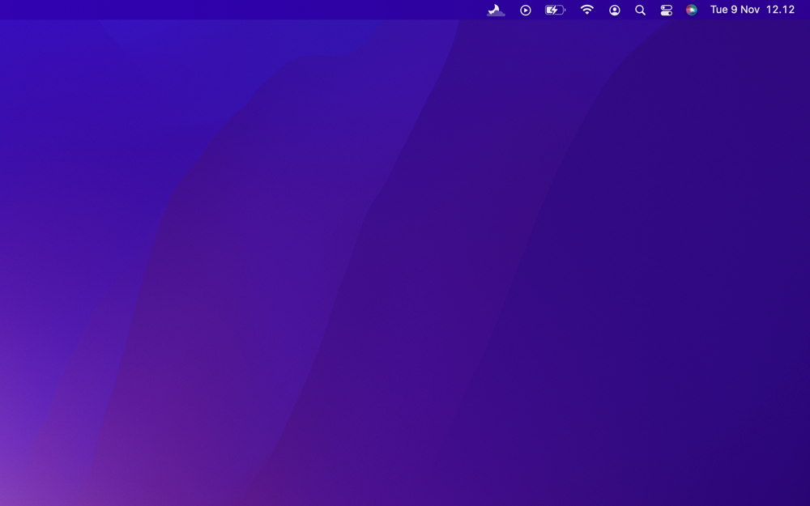
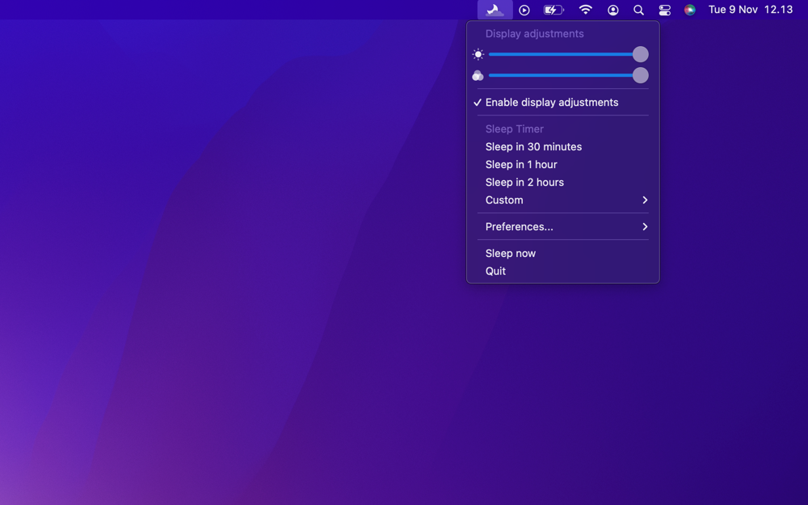
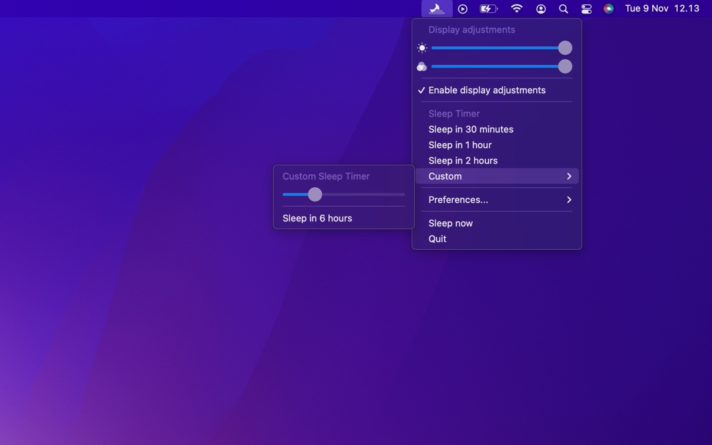
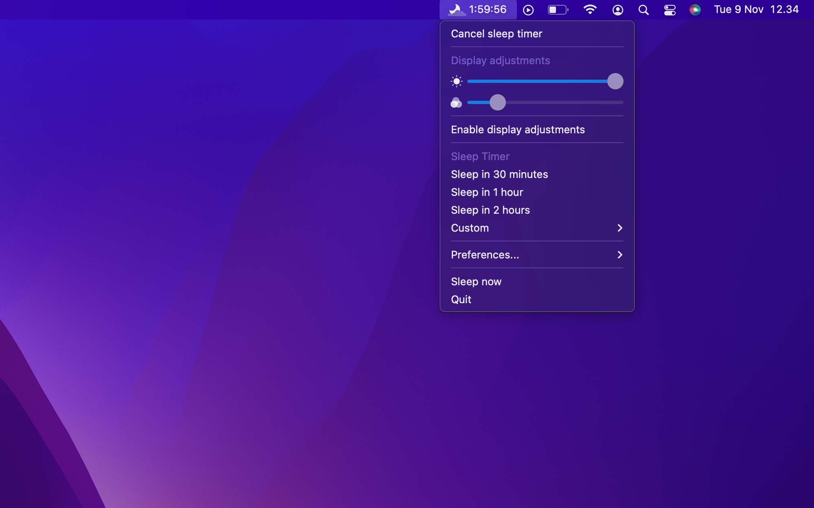
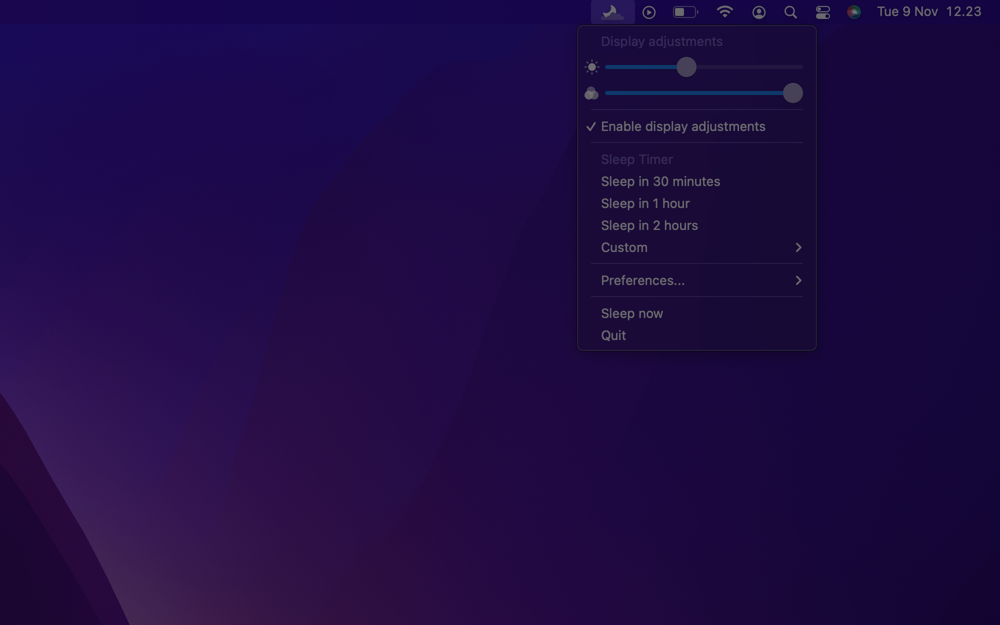
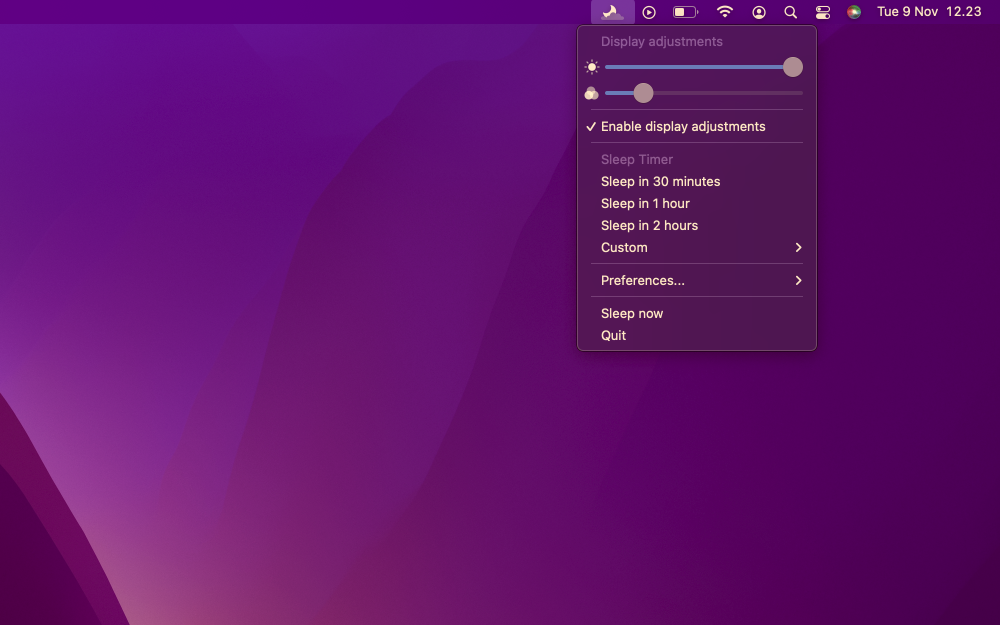

     
	 
     
	
	<h1>Sleep timer</h1>
	

		<b>Make your app fall asleep just like you 😴</b>
	

	 
    
	 
	 
     
	 

## Description

Sleep timer is a utility that lives in your menu bar that can put your Mac to sleep after a given time, help calm your eyes by lowering the brightness darker than darkest and reduce the blue light in your screen.

## Features

- Quickly set your Mac to go to sleep at a predefined time or a custom time (up to 24 hours)
- Shows the remaining time in the menu bar next to the icon
- Adjust the brightness lower than the built in brightness control
- Adjust the blue light precisely (Nightshift)
- Toggle the display adjustments on and off
- Disable the display adjustments when your Mac wakes up
- Remembers your settings
- Works with multiple displays and spaces simultaneously
- Can automatically launch at login
- Supports light and dark mode
- Ultra low performance impact

## Screenshots

<figcaption align="center">Sleep timer lives in the menu bar</figcaption>
 
 

<figcaption align="center">Quickly set sleep timer or make adjustments to the display</figcaption>
 
 

<figcaption align="center">You can also set a custom timer up to 24 hours</figcaption>
 
 

<figcaption align="center">The remaining time until sleep mode is displayed next to the icon in the menu bar</figcaption>
 
 

<figcaption align="center">Lower the brightness with a dark overlay</figcaption>
 
 

<figcaption align="center">Quickly reduce the blue light (nighshift)</figcaption>
 
 

## Frequently Asked Questions

#### Why did you make this app?

I made it becuase I often watch movies or series at night while falling asleep, and I was using a couple of different apps to achieve this. So I made a single app to help me fall asleep without the movie running and disturbing my sleep.

